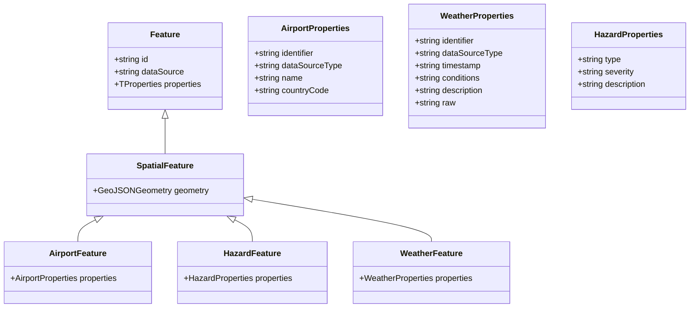
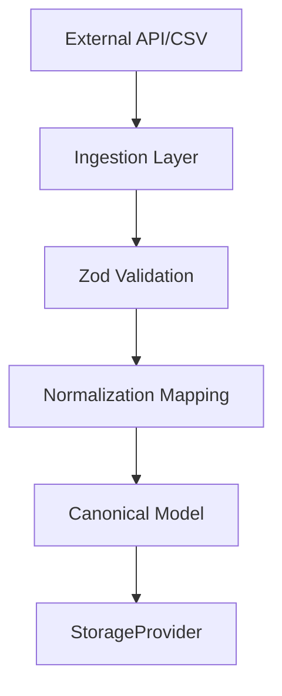

# SkyPath Sentinel: Canonical Data Models

This document defines the internal, canonical data structures for SkyPath Sentinel. These models are designed to be **universal** and **extensible**, ensuring that data from disparate sources (NOAA, FAA, Eurocontrol, OurAirports) can be normalized into a single, type-safe format for geospatial analysis.

---

## 1. Design Principles

*   **Normalization:** All external data (CSV, XML, proprietary JSON) must be mapped to these canonical models during ingestion.
*   **GeoJSON-First:** All spatial data is represented using GeoJSON standards to ensure compatibility with geospatial analysis libraries (e.g., `@turf/turf`).
*   **Polymorphic Identification:** Identifiers are not assumed to be ICAO codes; they are structured as `identifier` + `dataSourceType` pairs.
*   **Source Tracking:** Every model includes a `dataSource` field to allow for provenance tracking and debugging.
*   **Type-Safe Hierarchy:**
    *   `Feature<TProperties>`: Base interface for descriptive data.
    *   `SpatialFeature<TProperties, TGeometry>`: Extends `Feature` for data with required geometry.

---

## 3. Data Architecture Diagrams

### 3.1 Type Hierarchy

### 3.2 Data Ingestion Flow

---

## 4. Mapping Strategy

The ingestion layer (`DataPopulator` and `DataFetcher` implementations) is responsible for the transformation logic:

1.  **Fetch:** Retrieve raw data from the external source.
2.  **Validate:** Use `Zod` schemas to ensure the raw data meets minimum requirements.
3.  **Normalize:** Map external fields to the canonical model fields.
4.  **Store:** Save the normalized model (and optionally the raw data) to the `StorageProvider`.
